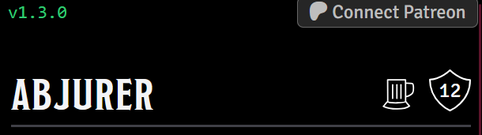
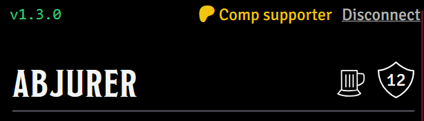
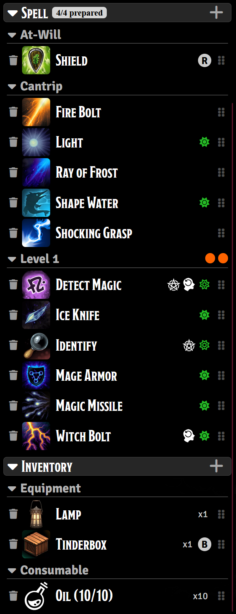

# Action Pack Enhanced

 

Enhances the Action Pack module by adding additional features and functionality as well as updating the module to support FoundryVTT v13+.

## New Features

- Added support for FoundryVTT v13+ and D&D5e 5.2.4
- Added the selected tokens race, classes, class levels and sublasses to the header display.
- Added the armor class of the selected token to the header display for when the DM says "What's your AC?" or "Does a ?? hit?"
- Added ability checks and saving throws to the header display, that suport modifier keys for Advantage (Alt) and Disadvantage (Ctrl).
- When the token is in the unconscious state, the header display will show a saving throw UI, simply click the skull icon to make a saving throw. Passes and fails will be marked accordingly. No need to open the chracter sheet anymore.
- Updated the item display to show the item's description when clicking on the text, and use the item when clicking on the dice icon.
- Added color coding to the item display to show the item's rarity (common (white), uncommon (green), rare (purple), very rare (gold)).
- Added a requested feature of Action Pack - drag to target. Now you can grab the item handle on the right side of an item and drag it to a token to target it and it will roll the attack automatically.

## Announcement
I now have a Patreon!!!

With the latest update (1.4.0) I have added Patreon support to the module, and that means I have also added Patreon only features to the module.

The features are not required to use the module in any way. The APE module is my expression of love for the community and for the Foundry Platform. I am a player and enjoy my games when they are not bogged down by having to click on numerous things in the middle of a game to do things that should be simple and easy to access and do. So I took this module that was originally made for v12, and I revamped it to support newer versions of Foundry.

However, that support takes time and effort, and while I do write code for a living full time during the day, I have to take time out of my free time to continue supporting this module. A few updates ago I added some basic stat tracking to this readme and I watched day after day as the number of downloads increased to over 10,000, and I thought, if I had just $1 for each of those downloads, just a single one-time dollar from each of them, it would drastically change my life. So I set out to add Patreon support that is in no way mandatory to use the module. If you would like to support me and help me get to the point where I can do this full time, that would be awesome, and that is the goal.

I have other modules that I have made for myself and my campaigns, but I have not put those modules out there becasue I don't think anyone would really use them the way I do and they are not really production quality if I am honest, but if the Patreon takes off, I may just add them as part of a tier reward like other creators do.

So with that, please find me on [Patreon](https://www.patreon.com/dungeonsandderps) if you would like to donate or get your mits on the newset shiny feature. Below are some screenshots of the new UI for Patreon, the verison number, and the Spell and Inventory when you are a supporter.

The header bar showing the verson number and the Patreon login button. This is what DMs will see, players will only see the version number

The header bar showing the verson number and the logged-in message (for testing I have a test account that bypasses subscribing; actual subs will see their sub tier here)

The spell and inventory section when your DM is logged in as a supporter. Players do not need to support to use the feature.

- You can see a + button in the Spell and Inventory headers. When clicked the compendium browser will open to spells or items, which ever button you click. Choosing items in the compendium browser will add them to your character sheet and update the APE ui to show them instantly. Adding weapons will place them in the weapon section and not the inventory section.
- Spells can now be prepared and unprepared right from APE. Clicking the prepare icon highlights prepared spells in green, and unprepared spels in gray.
- Every item can now be removed from your character sheet right inside of APE. Note: It does say it cannot be undone, but you can just add it back if you remove it accidentally through the compendium browser.
- inventory items, and weapons, have an inventory count that you can click on to increment and decrement in the absence of any automation modules. Automation modules will do it for you.

This is a tough feature to implement, and I am sorry DMs, I know you guys pay out a lot already to run your campaigns and your adventures in order to get lots of module support and features that make your games super awesome, but again, this is not really a feature that you need to run your games, it's just a nice-to-have type thing.